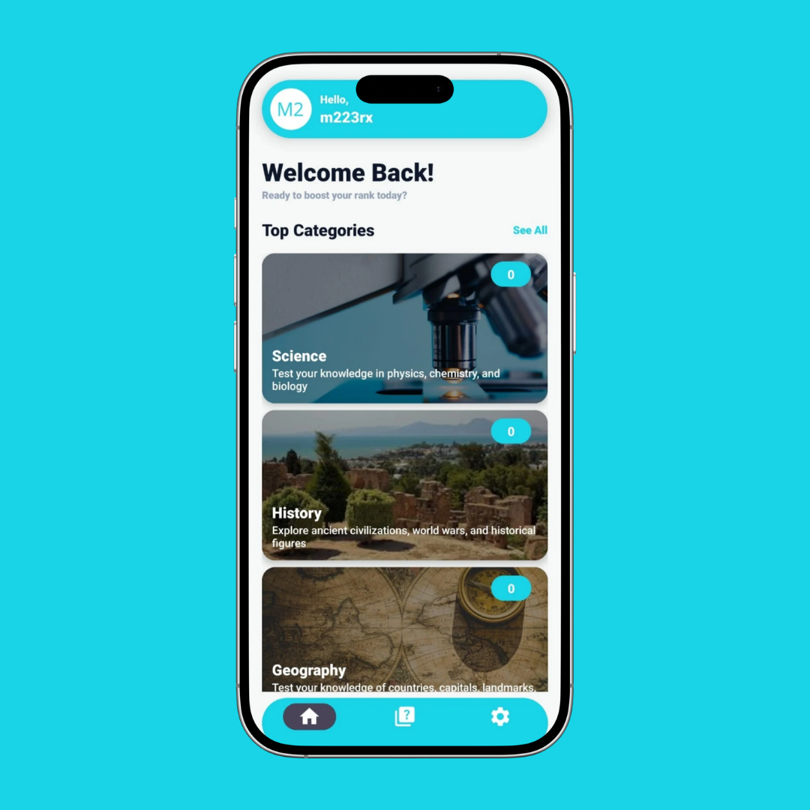

# 📱 NorthTrivia – Real-Time Quiz & Knowledge Challenge App

---

## 🚀 Features  

- **Daily & Random Quizzes**  
  Play quizzes across multiple categories including science, animals, geography, and more.

- **Real-Time Gameplay**  
  Answer questions instantly and track your progress during each session.

- **User Authentication**  
  Secure login and registration system powered by JWT authentication.

- **Leaderboard System**  
  Compete with other players and climb the rankings.

- **Category-Based Questions**  
  Explore quizzes organized into structured categories for better learning.

- **Progress Tracking**  
  Monitor your performance and improve over time.

- **Modern UI (Android)**  
  Clean, responsive, and intuitive mobile interface.

- **Custom Backend API**  
  Fully built with Flask for high performance and flexibility. 

---

## 🛠 Tech Stack

- **📱 Frontend (Mobile)**
    - [Java](https://www.java.com/) – Core app development
    - [Retrofit](https://square.github.io/retrofit/) – API communication

- **Backend:**  
  - [Python](https://flask.palletsprojects.com/en/stable/) – REST API
  - [MySQL](https://www.mysql.com/) – Database management

- **Tools & Libraries:**  
  - [Glide](https://bumptech.github.io/glide/) – Image loading  
  - [Gson](https://github.com/google/gson) – JSON parsing 

---

## 💡 Future Enhancements

- Multiplayer real-time quiz battles  
- Push notifications for daily challenges
- AI-generated quiz questions 
- Social features (friends, challenges)  
- Web version of the platform  
- Advanced analytics dashboard

---

## ⚠️ Status

- **This project is currently in Beta**
- Features may change
- Bugs may exist
- Continuous improvements and updates are planned

## 👨‍💻 Developer

m223rx – 2026

© 2026 m223rx. All rights reserved.
